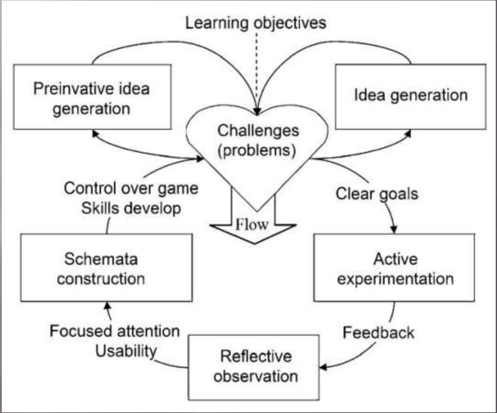
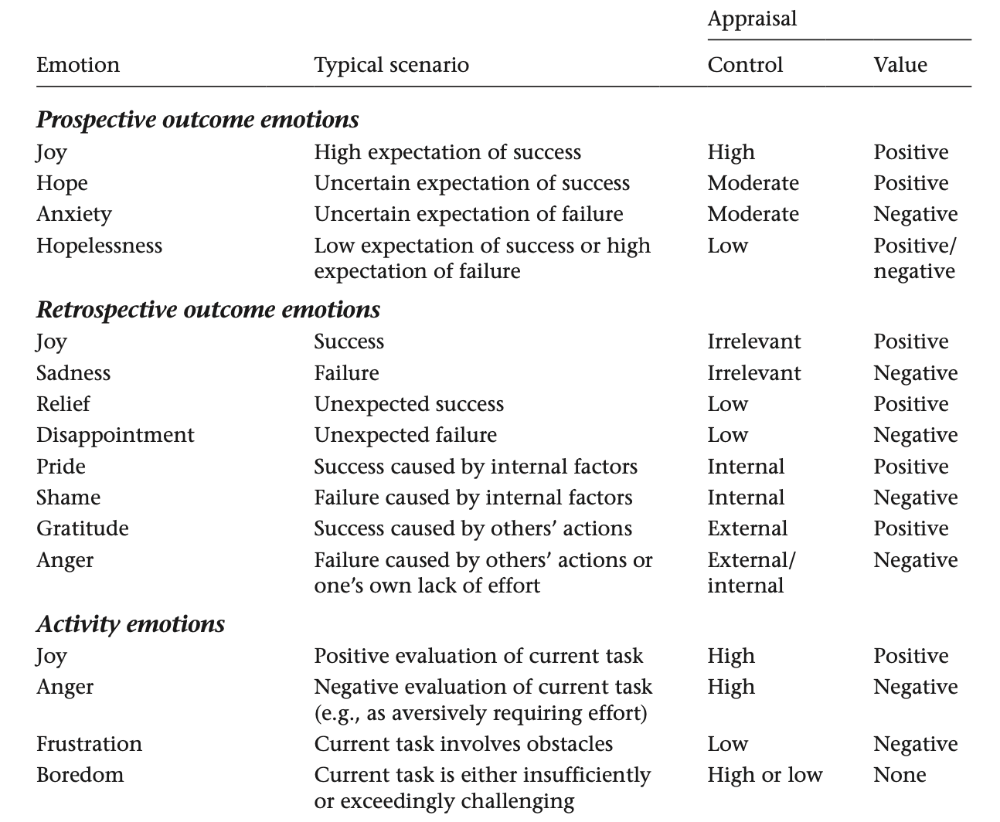
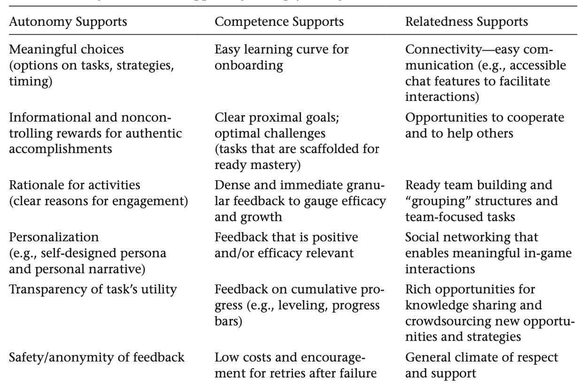

---
presentation:
  width: 1600
  height: 1000
  help: false
---

<!-- slide -->
# Game based learning

Game based learning (GBL) is a type of game play that has defined learning outcomes. Generally, game based learning is designed to balance subject matter with gameplay and the ability of the player to retain and apply said subject matter to the real world.

**Digital** GBL (DGBL) uses digtial devices and programs.

<!-- slide -->

# Key Features 
- Defined learning outcomes, meaningful learning experiences
- Provide context and real world value of skill and content
- Encourage deeper learning, integration of knowledge base and skill sets
- Seamless accountability, feedback, intrinsic and extrinsic motivators
- Combine audio, graphics and movement into an interactive and immersive environment (DGBL)

<!-- slide -->

# Domains
- Language Learning
- Mathematics and Science (STEM)
- Social Studies and History
- Development of Cognitive Skills

<!-- slide -->

<!-- slide -->

# Characteristics of good games
- FUN
- Age appropriate
- A safe environment to explore and in which to make mistakes
- Collaboration and competition
- Interaction and feedback
- Appropriate challenge, gradually increasing difficulty
- Clear, achievable goals, rules, measurable outcomes and rewards

<!-- slide -->

# Learning outcomes

**Visual**: The visual nature of games not only made the learning activity more fun and engaging, but it was a much easier way for them to learn as compared to other instructional methods they frequently encountered.

**Greater collaboration**: Students enjoy working together and working as a team. Many learners also enjoy helping other classmates when they experience difficulties, and the support and encouragement they received from team members during game-play.

**Concentration and focus**: The ability games to sharpen focus and concentration, both in the short term and over the long Term. It may also impact on the perception of students ability to learn.

**Teamwork**: This is one of the most commonly cited positive attributes to game based learning. The opportunity to work together, to share responsibility, to lean on one another when stuck, and so on.

<!-- slide -->

# Learning

<!-- slide -->

# Learning flow

<!-- slide -->

# Impact on teachers and teaching practices

**Enjoyment and motivation**: Being able to participate in the projects as much as their students, due in no small part to the enjoyment and motivation they see in the children. It allows teachers to engage in the activities which can also encourage students to want to take part if they see that their teacher is as well.

**Teacher role**: Teachers are finding that their role is changing in various ways. It allows the chance to interact more such as spending less time up at the white board talking and more time with smaller groups and seeing how they are going.

**Classroom management**: Teachers enjoy being able to work with and assess specific groups but need to keep in mind that they have to be highly organised in order to keep the game running and move groups on through their tasks. It all comes down to being organised.

**Teacher skills**: Using games can lead to teachers becoming more ICT orientated. They feel the games themselves are making them more aware of things that are out there.

<!-- slide -->

# Instructional Support, Feedback, and Coaching in Game-Based Learning
Instructional support, feedback, and coaching serve an important role in game-based learning environments. 

## Supporting Learning in Game-Based Environments through Feedback
The purpose of feedback is to help learners evaluate their progress and performance, identify knowledge gaps, and repair faulty knowledge.

<!-- slide -->

# Cognitive Foundations

<!-- slide -->

# Emotional Foundations

<!-- slide -->

# Motivational Foundations

<!-- slide -->

<!-- slide -->

# Practicalities of learning in gaming environment

- provide and explain the technology
- Match with curriculum – gaming outcomes and learning outcomes
- Time available, location, resources
- Associated activities, briefing, debriefing
- Building in reflection and collaboration

<!-- slide -->

# Assessment
Using games for assessment is about more than tracking points. 

One of the most common misconceptions is that all good learning games must assess learners within the game.
The truth is that assessment happens around a game more often than it happens inside the game, and teachers must still design and provide authentic, useful assessment tasks for students.

<!-- slide -->

# Analytics / Educational Data Mining
DGBL provides multiple possibilities for automatic analytics

- prediction
- discover
- relationship
- visualization

<!-- slide -->

# Development options

- Use entertainment games
- Modify entertainment games
- Use virtual worlds
- Use educational games
- Create games
- Students create games

<!-- slide -->

# GBL Limitations
**Curriculum**: The challenge for teachers to identify how a certain game would connect to the curriculum. Difficulty with integrating the play of the game into the time structure of the day.

**Game related**: The challenge for teachers to identify the accuracy and appropriateness of the content of the game. Irrelevant or distracting content from the game that could not be removed.

**Attitudes**: The challenge in persuading other school stakeholders to the value of the game in the classroom.

**Teacher support**: Lack of available time for teachers to learn the game and generate best practices with it. Lack of specific training and support on the effective use of games in the classroom.

**Assessment**: Traditional assessments do not often align with GBL, so new models and approaches must be considered.

<!-- slide -->

# Mission / Next steps

- convince non-users of games of their educational value
- encourage and support game developers in the creation of better educational games
- make educators aware of how to use games more effectively in education

