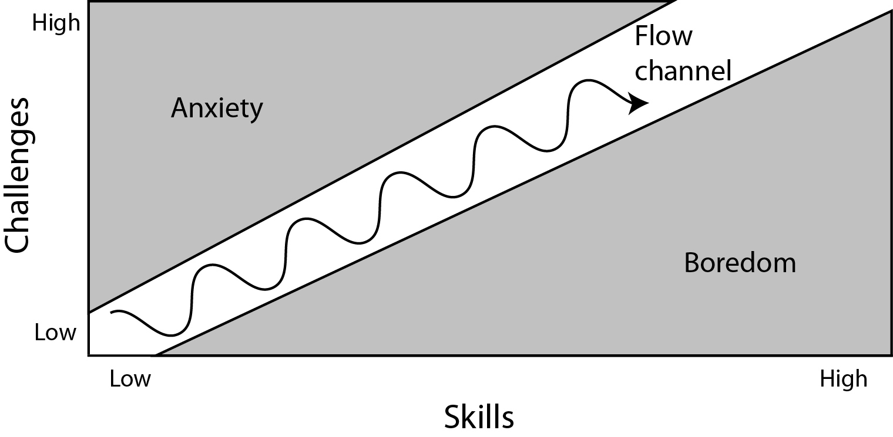
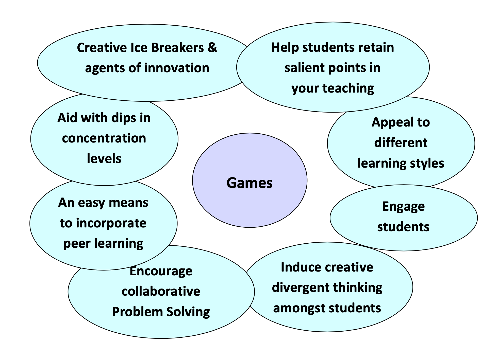
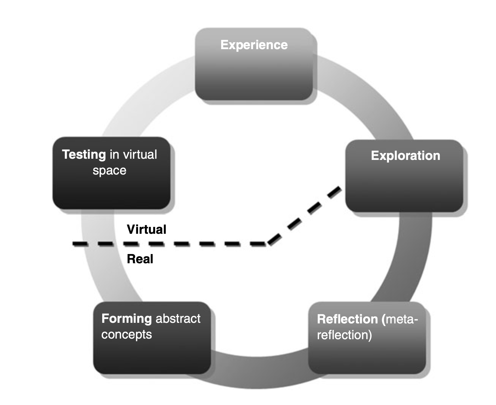
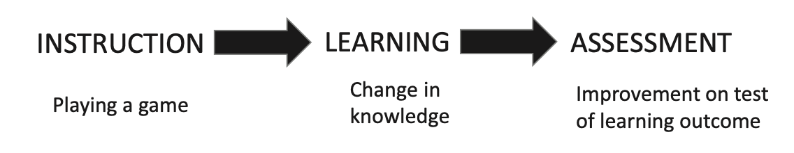

---
presentation:
  width: 1920
  height: 1080
  help: false
---

<!-- slide -->
# Game based learning

Game based learning (GBL) is a type of game play that has defined learning outcomes. Generally, game based learning is designed to balance subject matter with gameplay and the ability of the player to retain and apply said subject matter to the real world.

**Digital** GBL (DGBL) uses digital devices and software.

<!-- slide -->
# Principles
- Intrinsic motivation: playing is by and large voluntary and self-driven
- Learning through intense enjoyment and "fun"
- Authenticity: contextualized, goal oriented instead of abstract learning
- Self-reliance and autonomy: passions and interests that lead to a will to specialize
- Experiential learning: learning by doing

<!-- slide -->
## Mechanisms
- Rules: simple and binaru (e.g. if/then) or requiring more complex decision making
- Clear but challenging goals
- A fictional setting or "fantasy"
- Progressive difficulty levels
- Interaction and high degree of student control
- Immediate and constructive feedback
- A social element that allows people to share experience and build bonds

<!-- slide -->
## Flow

<!-- slide -->
## Flow emotions

<!-- slide -->
# Videogames
Computer games are possibly the most engaging pastime in the history of mankind. These games bring together combination of motivating elements not found together in any other medium.
**Games**:
- are a form of fun -> _enjoyment and pleasure_
- are a form of play -> intense and passionate _involvement_
- are rules -> _structure_
- are goals -> _motivation_
- are interactive -> _doing_
- are adaptive -> _flow_
- have outcomes and feedback -> _learning_
- have a win state -> ego _gratification_
- have conflict/competition/challenge/opposition -> _adrenaline_
- have problem solving -> sparks _creativity_
- have interaction -> _social groups_
- have characters and story -> _emotion_

<!-- slide -->
### 36 Learning principles
| learn | from |
|---|---|
|1. Active, Critical Learning Principle |_Doing and reflecting_|
|2. Design Principle | _Appreciating good design_ |
|3. Semiotic Principle  | _Seeing interrelationships_ |
|4. Semiotic Domains Principle | _Mastering game language_ |
|5. Metalevel Thinking About Semiotic Domains Principle | _Relating the game world to other worlds_|
|6. “Psychosocial Moratorium” Principle | _Taking risks with reduced consequences_|
|7. Committed Learning Principle | _Putting out effort because they care_|
|8. Identity Principle | _Combining multiple identities_|
|9. Self-Knowledge Principle | _Watching their own behavior_|
|10. Amplification Of Input Principle | _Getting more out than what they put in_|
|11. Achievement Principle | _Being rewarded for achievement_|
|12. Practice Principle | _Being encouraged to practice_|

<!-- slide -->
### 36 Learning principles
|  |  |
|---|---|
|13. Ongoing Learning Principle | _Having to master new skills at each level_|
|14. "Regime Of Competence" Principle | _Tasks being neither too easy nor too hard._|
|15. Probing Principle | _Doing, thinking and strategizing_|
|16. Multiple Routes Principle | _Getting to do things their own way_|
|17. Situated Meaning Principle | _Discovering meaning_|
|18. Text Principle | _Reading in context_|
|19. Intertextual Principle | _Relating information_|
|20. Multimodal Principle | _Meshing information from multiple media_|
|21. "Material Intelligence" Principle | _Understanding how knowledge is stored_|
|22. Intuitive Knowledge Principle | _Thinking intuitively_|
|23. Subset Principle | _Practicing in a simplified setting_|

<!-- slide -->
### 36 Learning principles
|  |  |
|---|---|
|24. Incremental Principle | _Being led from easy problems to harder ones_ |
|25. Concentrated Sample Principle | _Mastering upfront things needed later_ |
|26. Bottom-Up Basic Skills Principle | _Repeating basic skills in many games_ |
|27. Explicit Information On-Demand Just-In-Time Principle | _Receiving information just when it is needed_ |
|28. Discovery Principle | _Trying rather than following instructions_ |
|29. Transfer Principle | _Applying learning from problems to later ones_ |
|30. Cultural Models About The World Principle | _Thinking about the game and the real world_ |
|31. Cultural Models About Learning Principle | _Thinking about the game and how they learn_ |
|32. Cultural Models About Semiotic Domains | _Thinking about the games and their culture_ |
|33. Distributed Principle | _Finding meaning in all parts of the game_ |
|34. Dispersed Principle | _Sharing with other players_ |
|35. Affinity Group Principle | _Being part of the gaming world_ |
|36. Insider Principle | _Helping others and modifying games, in addition to just playing_ |

<!-- slide -->

# Key Features 
- Defined learning outcomes, meaningful learning experiences
- Provide context and real world value of skill and content
- Encourage deeper learning, integration of knowledge base and skill sets
- Seamless accountability, feedback, intrinsic and extrinsic motivators
- Combine audio, graphics and movement into an interactive and immersive environment (DGBL)

<!-- slide -->

# Domains
- Language Learning
- Mathematics and Science (STEM)
- Social Studies and History
- Development of Cognitive Skills

<!-- slide -->

<!-- slide -->

# Characteristics of good games
- FUN
- Age appropriate
- A **safe environment** to explore and in which to **make mistakes**
- Collaboration and competition
- Interaction and realtime feedback
- Appropriate challenge, gradually increasing difficulty
- Clear, achievable goals, rules, measurable outcomes and rewards

<!-- slide -->

# Learning outcomes

**Efficiency**: The visual nature of games not only made the learning activity more fun and engaging, but it was a much easier way for them to learn as compared to other instructional methods they frequently encountered. (antura example)

TODO data % improve

**Self Confidence**: 

**Greater collaboration**: Students enjoy working together and working as a team. Many learners also enjoy helping other classmates when they experience difficulties, and the support and encouragement they received from team members during game-play.

**Concentration and focus**: The ability games to sharpen focus and concentration, both in the short term and over the long Term. It may also impact on the perception of students ability to learn.

**Teamwork**: This is one of the most commonly cited positive attributes to game based learning. The opportunity to work together, to share responsibility, to lean on one another when stuck, and so on.

<!-- slide -->

# Learning

???? exploration

- introduction to videogame (+coach: tech + expectations)
- gameplay / experience (autonomous)
- game results / scores
- reflection / analysis (+coach)
- forming abstract concepts + real world application

<!-- slide -->

# Coach
Skills:
- ICT / Basic Digital Skills
- Minimal game playing experience
- Deep understanding of how a game can help learning and its differences with a  classic book/course
- Recognise different players skills and support their game play
- Engage students in playing and progression

Responsabilities:
- provide and explain the technology
- Match with curriculum – gaming outcomes and learning outcomes
- Time available, location, resources
- Associated activities, briefing, debriefing
- Building in reflection and collaboration

- DGBL terminology
- How to choose and introduce a game 
- How to help and stimulate engagement playing the game
- How to customize lesson pacing and clear expectations
- How to debrief a game session
- How to evaluate the outcomes

**Teacher skills**: 
- ICT orientated. They feel the games themselves are making them more aware of things that are out there.

 Instructional Support, Feedback, and Coaching in Game-Based Learning
Instructional support, feedback, and coaching serve an important role in game-based learning environments. 

Supporting Learning in Game-Based Environments through Feedback
The purpose of feedback is to help learners evaluate their progress and performance, identify knowledge gaps, and repair faulty knowledge.

<!-- slide -->
as designers:
# Cognitive Foundations

# Emotional Foundations

# Motivational Foundations

<!-- slide -->

# Assessment
Using games for assessment is about more than games scores. 

One of the most common misconceptions is that all good learning games must assess learners within the game.
The truth is that assessment happens around a game more often than it happens inside the game, and teachers must still design and provide authentic, useful assessment tasks for students.

<!-- slide -->

# Analytics / Educational Data Mining
DGBL provides multiple possibilities for automatic analytics

- discover (patterns)
- relationship (between parameters)
- data visualization
- prediction model

<!-- slide -->

# Development options

- Use entertainment games (Assassin Creed / Civilization)
- Modify entertainment games ()
- Use virtual worlds (Minecraft)
- Use educational games (MinecraftEdu)
- Create games ()
- Students create games

<!-- slide -->

# GBL Limitations
**Curriculum**: The challenge for teachers to identify how a certain game would connect to the curriculum. Difficulty with integrating the play of the game into the time structure of the day.

**Game related**: The challenge for teachers to identify the accuracy and appropriateness of the content of the game. Irrelevant or distracting content from the game that could not be removed.

**Attitudes**: persuading all stakeholders about the value of the game.

**Teacher support**: Lack of available time for teachers to learn the game and generate best practices with it. Lack of specific training and support on the effective use of games in the classroom.

**Assessment**: Traditional assessments do not often align with GBL, so new models and approaches must be considered.

<!-- slide -->

# DGBL challenges

- convince non-users of games of their educational value
- encourage and support game developers in the creation of better educational games
- make educators aware of how to use games more effectively in education

<!-- slide -->
# some games examples

